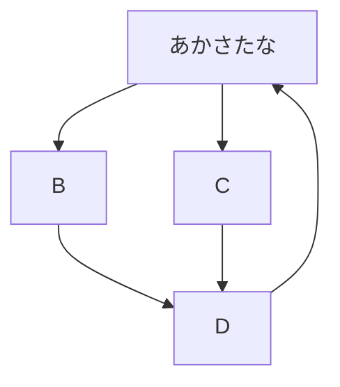
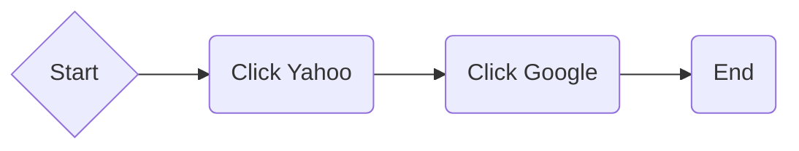
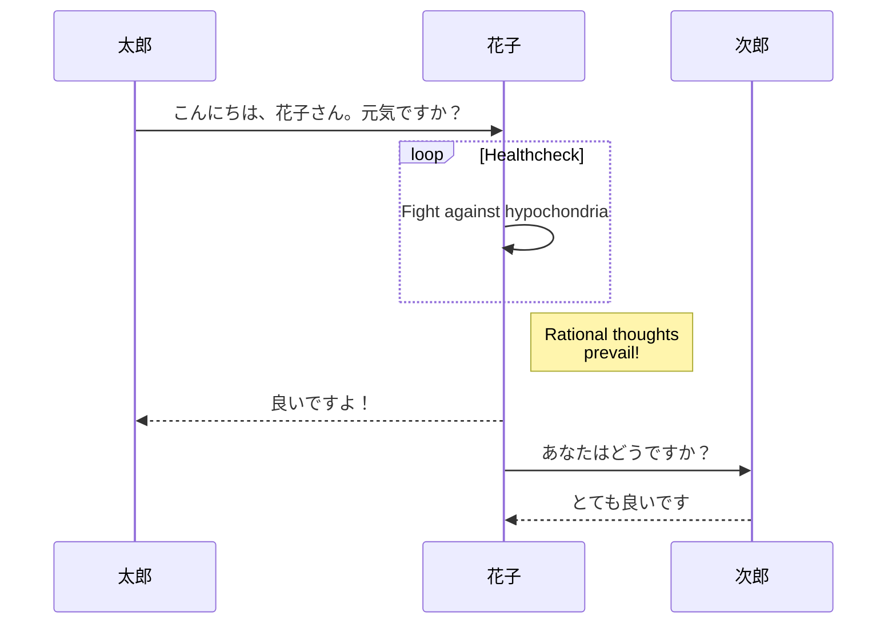
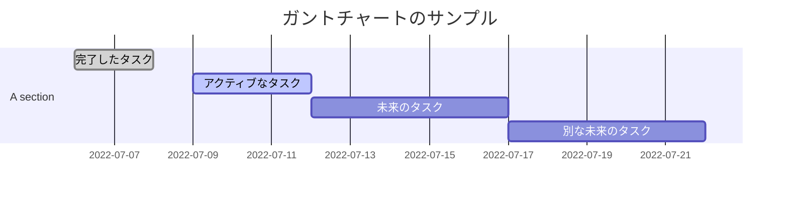
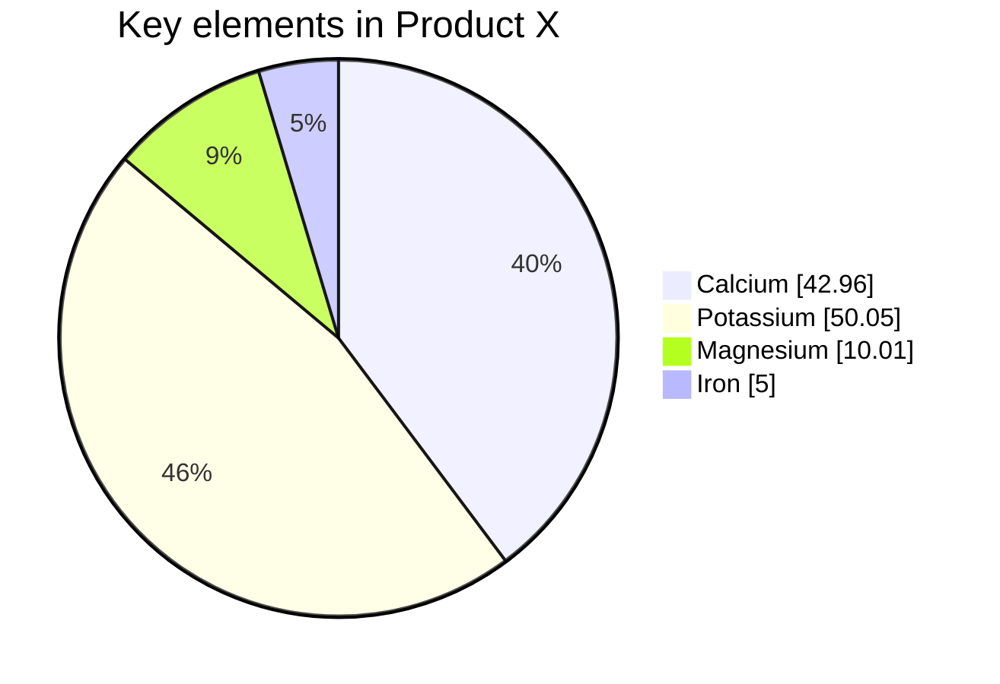

# 見出し
## 中
### 小
1. これが１
   - 箇条書き
   - 改
2. すげえええええ






# sss





1. C:\Users\Ueda\Documents\MATLAB\ロボットプログラム2\gairann_kai.m このプログラムの

```mat
    theta1 = data(x,10)*pi/180-data(x,19)*pi/180; 
    theta2 = data(x,9)*pi/180-data(x,18)*pi/180;  
    theta3 = data(x,8)*pi/180-data(x,17)*pi/180;  
    theta4 = data(x,3)*pi/180-data(x,12)*pi/180;
    theta5 = data(x,5)*pi/180+data(x,14)*pi/180;
    theta6 = data(x,7)*pi/180-data(x,16)*pi/180;  
    theta7 = data(x,2)*pi/180-data(x,11)*pi/180;  
    theta8 = data(x,4)*pi/180+data(x,13)*pi/180;
    theta9 = data(x,6)*pi/180-data(x,15)*pi/180;
    dtheta1 = data(x,10)*pi/180-data(x,19)*pi/180-(data(x-1,10)*pi/180-data(x-1,19)*pi/180); 
    dtheta2 = data(x,9)*pi/180-data(x,18)*pi/180-(data(x-1,9)*pi/180-data(x-1,18)*pi/180);  
    dtheta3 = data(x,8)*pi/180-data(x,17)*pi/180-(data(x-1,8)*pi/180-data(x-1,17)*pi/180);  
    dtheta4 = data(x,3)*pi/180-data(x,12)*pi/180-(data(x-1,3)*pi/180-data(x-1,12)*pi/180);
    dtheta5 = data(x,5)*pi/180+data(x,14)*pi/180-(data(x-1,5)*pi/180+data(x-1,14)*pi/180);
    dtheta6 = data(x,7)*pi/180-data(x,16)*pi/180-(data(x-1,7)*pi/180-data(x-1,16)*pi/180);  
    dtheta7 = data(x,2)*pi/180-data(x,11)*pi/180-(data(x-1,2)*pi/180-data(x-1,11)*pi/180);  
    dtheta8 = data(x,4)*pi/180+data(x,13)*pi/180-(data(x-1,4)*pi/180+data(x-1,13)*pi/180);
    dtheta9 = data(x,6)*pi/180-data(x,15)*pi/180-(data(x-1,6)*pi/180-data(x-1,15)*pi/180);
```
これが角度の指定